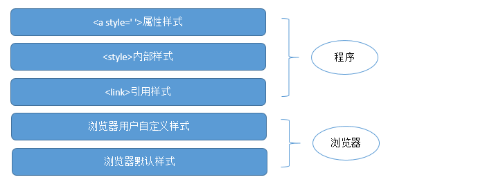

### 五毛钱的css之旅
# CSS

CSS——Cascading Style Sheets——层叠样式表

# 样式来源

**********************************************	
# style
### 1. postion 定位
### 2. display 元素显示
### 3. selector 元素的选择
### 4. float   浮动元素
### 5.  
### 6. 
### 7. otehr 同样重要

*********************************************  
# 文字小图标
## [Font Awesome](https://www.thinkcmf.com/font/icons#new)