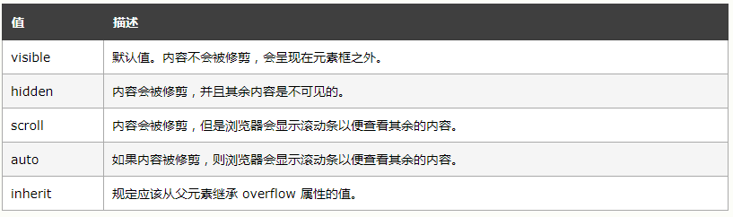

### 来五毛钱的CSS

## float

1. 初衷：实现文字环绕效果; 元素具有包裹性，如table
	
2. 高度坍塌
	
	div无高度的时候，会根据内容自动扩展高度，而设置float之后，div将不会根据float的元素自动扩展
	
## 清除float
清除float的方式

1.  父元素添加 overflow: hidden;
2.  浮动元素最后添加一个clear:both
3.  clearfix --推荐

	```
		clearfix:after{
			clear:both;
			content:'';
			display: table;
		}
		clearfix {
			*zoom: 1;
		}
	```

## overflow


### overflow：hidden清除浮动

*************************************
	